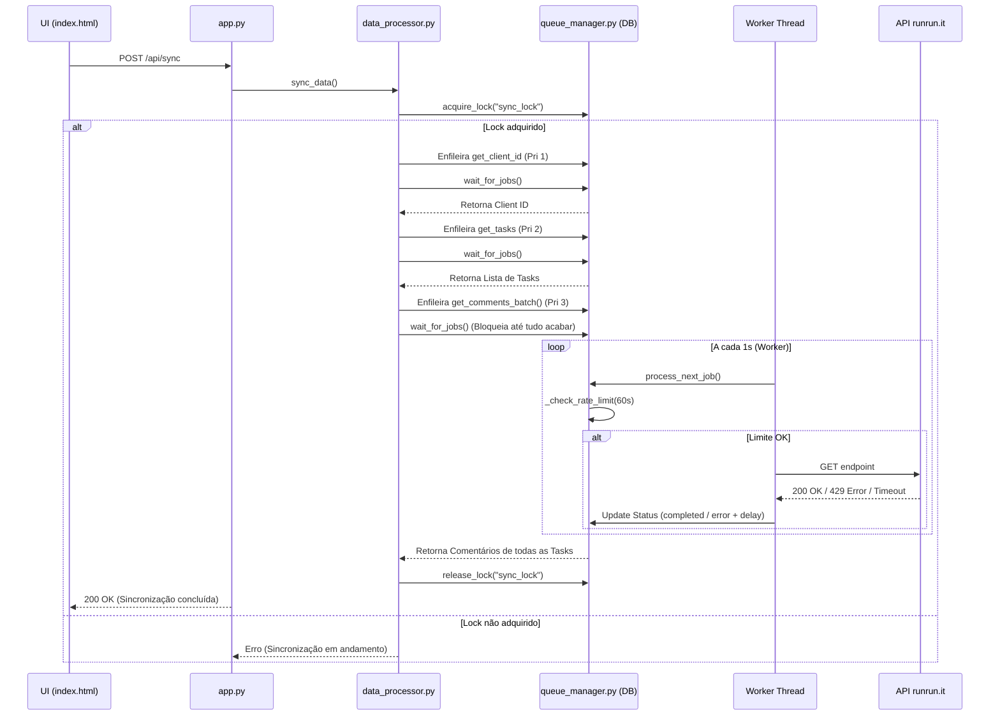

# Arquitetura de Sincronização, Fila e Rate Limiting

## 1. Visão Geral
O sistema de integração com a API do runrun.it foi reescrito para utilizar uma **Fila de Processamento Centralizada** (`queue_manager.py`) baseada no banco SQLite local. Essa arquitetura permite um controle refinado sobre o limite de taxa (Rate Limiting), priorização de chamadas e resiliência (retries e backoff).

## 2. Parâmetros Configuráveis
Os seguintes parâmetros operam o núcleo da fila (em `queue_manager.py`):
- **MAX_REQ_PER_MIN** (`30`): Limite máximo de requisições disparadas por janela deslizante.
- **SLIDING_WINDOW_SEC** (`60`): Tempo em segundos para contar as requisições ativas.
- **MAX_RETRIES** (`3`): Quantidade de vezes que um *job* com falha de rede/timeout tentará ser executado novamente.
- **RETRY_DELAYS** (`[1, 3, 9]`): Atrasos progressivos (em segundos) aplicados a cada retentativa.

## 3. Prioridades (FIFO com Prioridade)
A fila obedece um fluxo de processamento FIFO (First In, First Out), porém respeita uma fila de prioridades rigorosa para evitar travamentos de escopo principal:
- **Prioridade 1:** Busca de Clientes e Metadados base (Crítico)
- **Prioridade 2:** Busca de Tasks e Projetos
- **Prioridade 3:** Busca de Comentários (Maior volume)

## 4. Diagrama de Sequência (Fluxo de Sincronização)

## 5. Throttling Adaptativo e Resiliência
Caso a API retorne um erro do tipo `429 Too Many Requests`, o sistema identificará e aplicará um **backoff mais agressivo** (`delay = delay + 10s`), forçando a fila a desacelerar naturalmente sem perder os *jobs* processados até o momento.

## 6. Procedimentos de Monitoramento Operacional
- **Dashboard Administrativo:** Acesse a rota `/debug` (disponível via botão ⚙ Debug no header) para verificar os status em tempo real.
- **Alertas de Fila Cheia:** Se a fila acumular mais de 100 requisições simultâneas aguardando (`pending`), uma barra de alerta vermelha surgirá no painel do administrador para acompanhamento da vazão.
- **Limpeza de Fila:** Caso ocorra travamento extremo, o botão "Limpar Logs" reseta as tabelas auxiliares de log e o estado de debug da fila pode ser verificado no banco SQLite (`data/nuclea.db -> tabela api_queue`).
