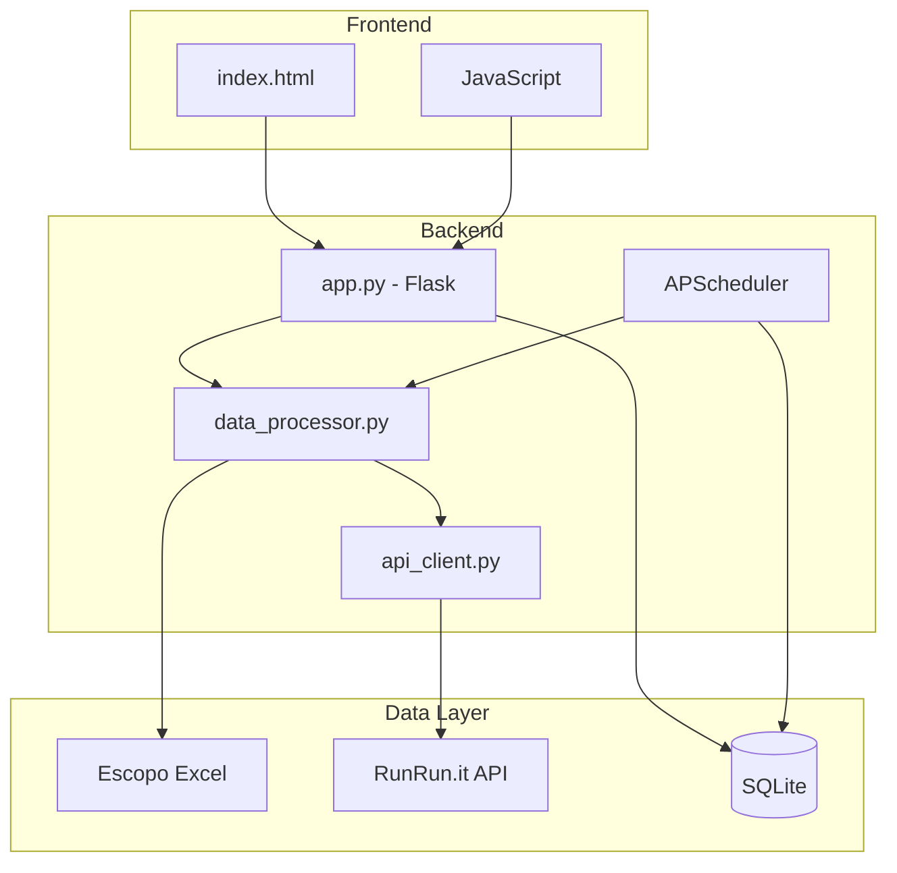

# Plano de Implementação - Atualizações do Dashboard

## Visão Geral do Projeto

Dashboard Flask para acompanhamento de escopo do cliente **NÚCLEA** vs realizado (RunRun.it API). Atualmente sem persistência - dados carregados uma única vez na inicialização.

---

## 1. Refatoração da Interface do Dashboard

### 1.1 Divisão de Visões (Mensal / Anual)

**Objetivo**: Criar alternância entre Visão Mensal e Visão Anual no dashboard.

**Implementação**:
- Adicionar toggle/tabs no header para alternar entre visões
- Visão Anual: usa date pickers existentes (De/Até)
- Visão Mensal: exibe botões para meses específicos + seletor de ano

**Arquivos envolvidos**:
- `runrun_report/templates/index.html` - adicionar UI de alternância
- `runrun_report/app.py` - ajustar endpoints para suportar ambas visões

### 1.2 Controle de Filtros - Visão Anual

**Comportamento atual**: Date pickers "De" e "Até" já existem.

**Atualização necessária**:
- Manter os date pickers existentes
- Ajustar lógica de filtering para considerar período anual completo por padrão

### 1.3 Controle de Filtros - Visão Mensal

**Comportamento esperado**:
- Seletor de ano (dropdown)
- Botões para cada mês (Jan, Fev, Mar, etc.)
- Apenas meses com dados processados devem estar ativos
- Se base possuir apenas ano corrente, exibir ano atual estaticamente

**Lógica no frontend**:
```javascript
// Detectar meses com dados
const mesesComDados = [...new Set(entregas.map(e => e.mes_ano))].sort();
// Renderizar botões apenas para esses meses
```

---

## 2. Modo Debug e Detalhamento de Requisições

### 2.1 Interface - Nova Tela Debug

**Rota**: `/debug` (página completa)

**Elementos**:
- Botão no header para acessar modo Debug (ícone ⚙ ou "Debug")
- Toggle no `.env` para ativar/desativar a visibilidade do botão

**Variável .env**:
```
DEBUG_MODE_ENABLED=true
```

### 2.2 Log de Processamento

**Objetivo**: Exibir todas as requisições à API (comentários, tarefas, etc.)

**Implementação**:
- Criar sistema de logging estruturado em memória (ou arquivo)
- Registrar cada requisição: endpoint, parâmetros, resposta (resumo)
- Exibir em tabela na página debug

**Campos do log**:
| Campo | Descrição |
|-------|-----------|
| Timestamp | Data/hora da requisição |
| Endpoint | URL do endpoint chamado |
| Parâmetros | Parâmetros enviados |
| Status | Sucesso/Erro |
| Tempo | Duração em ms |
| Registros | Quantidade de registros retornados |

### 2.3 Rastreabilidade de Itens Ignorados

**Objetivo**: Listar explicitamente itens que foram ignorados pela lógica de negócio

**Exemplos de itens ignorados**:
- Comentário com hashtag não mapeada ao escopo
- Comentário de sistema (is_system_message: true)
- Tarefa sem título "Gestão de Atendimento"
- Hashtag com formato inválido

**Implementação**:
- Criar lista de "itens ignorados" durante o processamento
- Exibir em seção separada na página debug

---

## 3. Persistência e Sincronização (SQLite)

### 3.1 Bootstrap - Criação do Banco e Carga Inicial

**Objetivo**: Na primeira execução, criar banco SQLite automaticamente e realizar fetch integral dos dados.

**Tabelas SQLite**:

```sql
-- Tabela de escopo (do Excel)
CREATE TABLE escopo (
    id INTEGER PRIMARY KEY AUTOINCREMENT,
    grupo TEXT,
    entregavel TEXT,
    qtd_mes INTEGER,
    qtd_ano INTEGER,
    previsto_acumulado INTEGER,
    slug TEXT UNIQUE
);

-- Tabela de entregas (da API)
CREATE TABLE entregas (
    id INTEGER PRIMARY KEY AUTOINCREMENT,
    task_id INTEGER,
    projeto TEXT,
    grupo TEXT,
    hashtag TEXT,
    scope_slug TEXT,
    quantidade INTEGER,
    data TEXT,
    mes_ano TEXT,
    mapeado BOOLEAN,
    created_at TIMESTAMP DEFAULT CURRENT_TIMESTAMP
);

-- Tabela de log de sincronização
CREATE TABLE sync_log (
    id INTEGER PRIMARY KEY AUTOINCREMENT,
    sync_type TEXT,
    started_at TIMESTAMP,
    completed_at TIMESTAMP,
    records_fetched INTEGER,
    status TEXT,
    error_message TEXT
);

-- Tabela de debug log
CREATE TABLE debug_log (
    id INTEGER PRIMARY KEY AUTOINCREMENT,
    timestamp TIMESTAMP DEFAULT CURRENT_TIMESTAMP,
    endpoint TEXT,
    params TEXT,
    status TEXT,
    duration_ms INTEGER,
    records_count INTEGER,
    ignored_reason TEXT
);
```

**Lógica de bootstrap**:
1. Verificar se arquivo SQLite existe
2. Se não existir: criar banco + executar carga completa
3. Se existir: carregar dados do SQLite (não da API)

### 3.2 Atualização Automática (APScheduler)

**Objetivo**: Sincronização diária à meia-noite

**Implementação com APScheduler**:
```python
from apscheduler.schedulers.background import BackgroundScheduler

scheduler = BackgroundScheduler()
scheduler.add_job(
    sync_data,
    'cron',
    hour=0,
    minute=0,
    id='daily_sync'
)
scheduler.start()
```

**Configurações**:
- Executar às 00:00 todos os dias
- Sincronização completa (fetch integral)

### 3.3 Sincronização Manual

**Objetivo**: Botão no modo Debug para sincronização sob demanda

**Implementação**:
- Endpoint: `POST /api/sync` (apenas se DEBUG_MODE_ENABLED=true)
- Botão na página debug: "Sincronizar Agora"
- Retorna status da sincronização

---

## 4. Requisitos Técnicos

### 4.1 SQLite como Fonte Primária

**Fluxo de dados após implementação**:
```
Inicialização do servidor:
├── Verificar se SQLite existe
│   ├── NÃO → Criar banco + carga completa da API
│   └── SIM → Carregar dados do SQLite
│
├── Dados em memória (DataFrames)
│   ├── Usados para renderização do dashboard
│   └── Atualizados após cada sincronização
```

### 4.2 Otimização de Queries

**Estratégias**:
- Indexar colunas frequentemente filtradas: `data`, `mes_ano`, `grupo`, `scope_slug`
- Criar views materializadas para agregações comuns
- Cache em memória com TTL para evitar queries repetidas

**Indexes recomendados**:
```sql
CREATE INDEX idx_entregas_data ON entregas(data);
CREATE INDEX idx_entregas_mes_ano ON entregas(mes_ano);
CREATE INDEX idx_entregas_grupo ON entregas(grupo);
CREATE INDEX idx_entregas_scope_slug ON entregas(scope_slug);
```

---

## 5. Arquitetura Proposta



---

## 6. Dependências a Adicionar

```
# requirements.txt
apscheduler    # Agendamento de tarefas
pandas         # Já existe
sqlite3        # Biblioteca padrão Python
```

---

## 7. Variáveis de Ambiente (.env)

```bash
# Existing
APP_KEY=...
USER_TOKEN=...
CLOUDFLARE_TUNNEL_TOKEN=...

# New
DEBUG_MODE_ENABLED=true
SQLITE_DB_PATH=data/nuclea.db
SYNC_SCHEDULE=0 0 * * *  # Cron format - daily at midnight
```

---

## 8. Endpoints da API

| Método | Rota | Descrição |
|--------|------|-----------|
| GET | `/api/data` | Dados do dashboard (do SQLite) |
| GET | `/api/export` | Exportar Excel |
| POST | `/api/sync` | Sincronização manual (debug only) |
| GET | `/debug` | Página de debug |
| GET | `/api/debug/log` | Log de requisições |
| GET | `/api/debug/ignored` | Itens ignorados |

---

## 9. Sequência de Implementação

1. **Camada de Dados SQLite**
   - Criar módulo `database.py` para gerenciamento do SQLite
   - Implementar funções de CRUD
   - Adicionar indexes

2. **Sincronização**
   - Integrar APScheduler
   - Implementar sincronização completa
   - Adicionar endpoint manual

3. **Dashboard Refatorado**
   - Adicionar alternância de visões
   - Implementar filtros específicos por visão
   - Ajustar endpoints

4. **Modo Debug**
   - Criar página debug
   - Implementar logging
   - Adicionar toggle no .env

5. **Testes e Validação**
   - Testar carga inicial
   - Testar sincronização
   - Validar performance